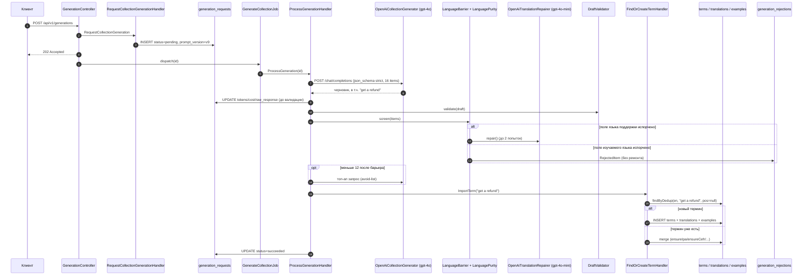
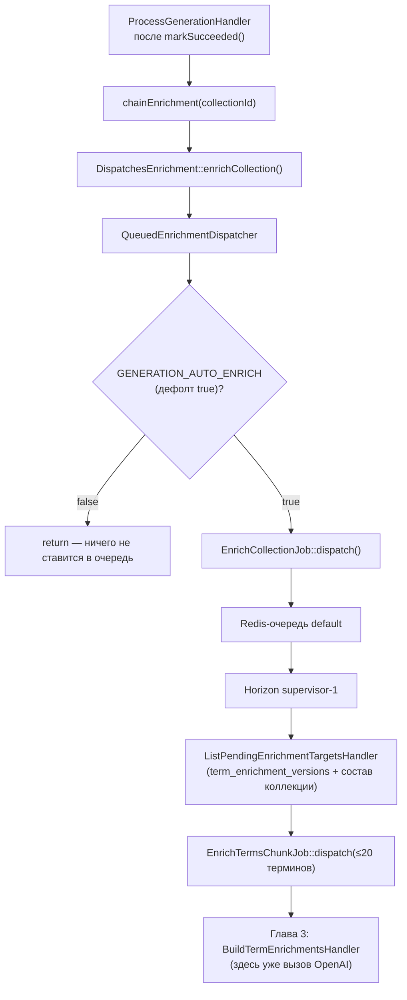
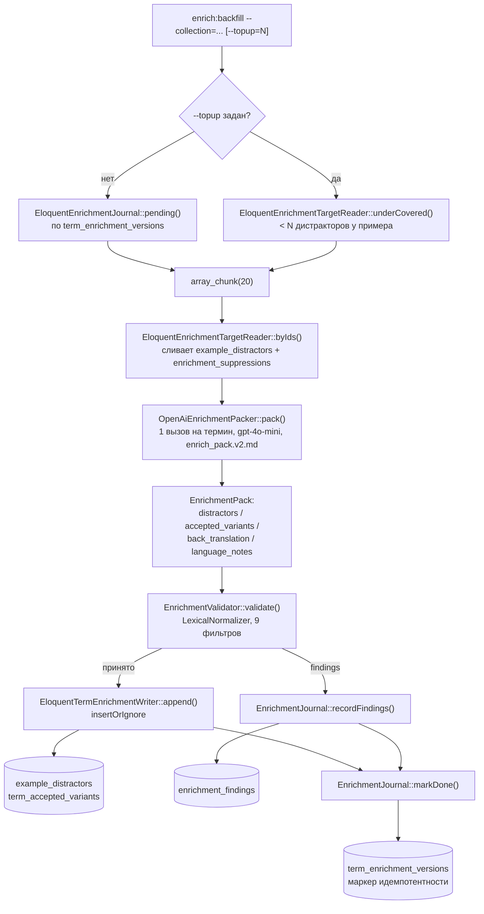
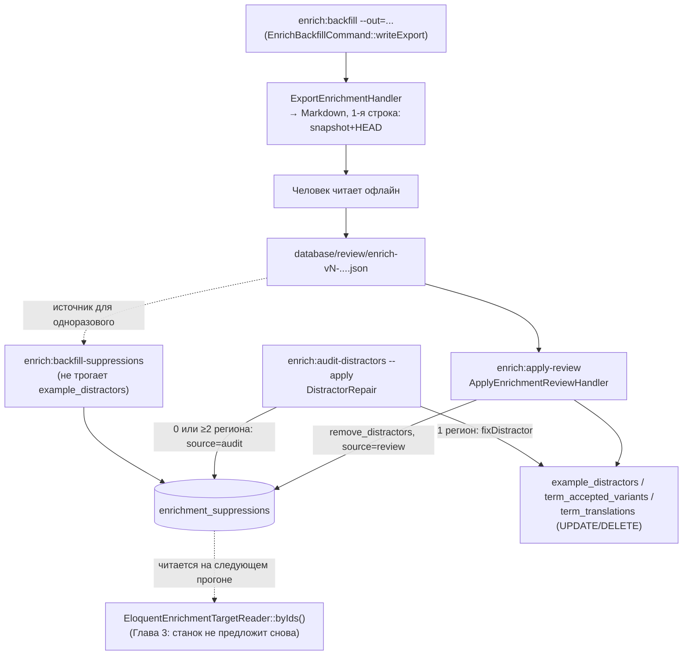
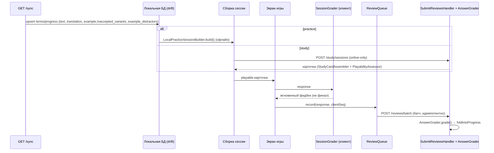
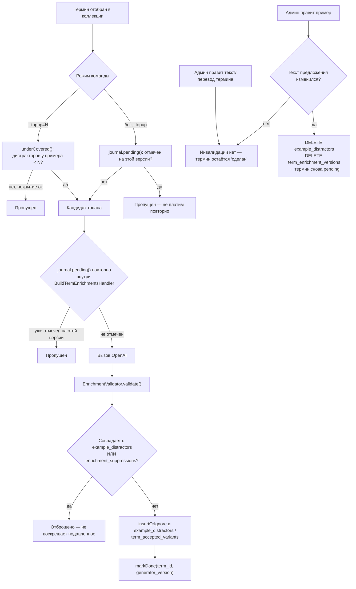

# Жизненный цикл термина в backend2

Этот документ прослеживает один термин через всю систему — от запроса пользователя на
генерацию коллекции до того, как термин разыгрывается на телефоне и снова возвращается в
«станок» обогащения. Каждое утверждение сверено с кодом репозитория `backend2/` (и, где нужно,
с `mobile/`) и с живой схемой Postgres на момент написания. Ссылки на код — в формате
`app/Modules/.../Class.php:строка`, путь — относительно `backend2/`, если не указано иное.

Сквозной пример — вымышленный термин **«get a refund»** в вымышленной коллекции
**«Возвраты и жалобы»** (ru→en). Ни термина, ни коллекции с таким названием в реальной базе
нет — это иллюстрация механизма, а не выгрузка реальных данных. Там, где утверждение не удалось
подтвердить чтением кода, оно помечено как **«не подтверждено кодом, TODO»** вместо догадки.

> **ru→en здесь — ПАРАМЕТР примера, а не свойство механизма.** Пара языков — свойство коллекции
> (`collections.source_lang`/`target_lang`), она параметризована по всему пути и передаётся в
> промпт именами, а не кодами (`LanguageCatalog`/`LanguageName`). Ниже «английское поле» всюду
> значит «поле изучаемого языка», «русское поле» — «поле языка поддержки»; конкретные `ru`/`en`
> подставлены потому, что это пара сквозного примера. Где ограничение действительно есть — это
> отмечено отдельно (детектор чистоты `LanguagePurity` имеет мнение только о `ru`/`uk`/`en`).

---

## Глава 1. РОЖДЕНИЕ

### Запрос

Клиент отправляет `POST /api/v1/generations` (маршрут — `app/Modules/Generation/Presentation/Http/routes.php:12`,
префикс `api/v1` навешивается в `GenerationServiceProvider::boot()`,
`Infrastructure/Provider/GenerationServiceProvider.php:246-249`). Тело валидирует
`RequestGenerationRequest` (`Presentation/Http/Request/RequestGenerationRequest.php:19-28`):

```php
'prompt'      => ['required', 'string', 'min:2', 'max:500'],
'levels'      => ['sometimes', 'array', 'min:1'],
'levels.*'    => ['string', 'in:A1,A2,B1,B2,C1,C2'],
'size'        => ['sometimes', 'integer', 'min:8', 'max:25'],
'source_lang' => ['sometimes', 'string', 'min:2', 'max:5'],
'target_lang' => ['sometimes', 'string', 'min:2', 'max:5'],
```

Смысл полей подтверждён прямо в тексте промпта (`Infrastructure/Prompt/generate_collection.v9.md`):
**`target_lang` — изучаемый язык** (для нашего примера — английский), **`source_lang` — родной
язык учащегося** (русский). Для «Возвратов и жалоб» запрос выглядит так:

```json
{ "prompt": "возвраты и жалобы: оформить возврат товара, пожаловаться на сервис",
  "levels": ["A2", "B1"], "size": 12 }
```

`GenerationController` подставляет дефолты `DEFAULT_LEVELS=['A2','B1']`, `DEFAULT_SIZE=12`, а
`source_lang='ru'`, если не передан (`Presentation/Http/Controller/GenerationController.php:29-30,46`);
`target_lang`, если не передан, разрешается в хендлере через `DefaultTargetLangReader`, с
фолбэком на `'en'` (`Application/Command/RequestCollectionGenerationHandler.php:69-71`).

### Регистрация запроса и постановка в очередь

`RequestCollectionGenerationHandler` (`Application/Command/RequestCollectionGenerationHandler.php`)
проверяет идемпотентность по клиентскому ULID, дневную квоту (`GenerationQuota` +
`GenerationDailyLimit`, строки 63-66), и создаёт агрегат `GenerationRequest::open(...)` со
статусом `pending` и `promptVersion` — константа **`PROMPT_VERSION`**, на HEAD `'v9'`. Строка
в `generation_requests`:

| колонка | значение |
|---|---|
| prompt / normalized_prompt | текст запроса / его нормализованная форма (`PromptNormalizer::normalize()`, `Domain/Service/PromptNormalizer.php:14-23`) |
| source_lang / target_lang | `ru` / `en` |
| levels / size | `["A2","B1"]` / `12` |
| prompt_version | `v9` |
| status | `pending` → `running` → `succeeded` |

> **Какая версия промпта работает на самом деле.** `PROMPT_VERSION = 'v9'` — версия стека **v1**:
> один файл `generate_collection.v9.md`, один вызов, модель `services.openai.generate_model`
> (`gpt-4o`). Боевой стек по умолчанию — **v2** (`GENERATION_STACK`, дефолт `v2` в
> `config/services.php`): ядро карточки собирается каталогом секций
> **`core_prompt_version` = `v11.1`** на **`core_model` = `gpt-5.4`**, механика (принятые формы и
> дистракторы) — **`mechanics_prompt_version` = `v13.1`** на **`mechanics_model` = `gpt-4o-mini`**
> (решение К2, `docs/bakeoff-v11-ab.md`). `GENERATION_STACK=v1` — механизм отката на замороженный
> путь v9, временный: его судьба решается после перегенерации витрины (DECISIONS п. 131).
> Ниже глава прослеживает путь **v1**, потому что именно он расписан пошагово; в стеке v2
> меняются промпт, модель и адаптер, а последовательность «черновик → валидатор → барьер →
> материализация» — та же.

Контроллер диспатчит фоновую работу, только если запись новая (`GenerationController.php:55-57`):
`DispatchesGeneration` → `QueuedGenerationDispatcher` → `GenerateCollectionJob::dispatch($id)`
(`Application/Port/DispatchesGeneration.php`, `Infrastructure/Adapter/QueuedGenerationDispatcher.php:13-16`).
Ответ клиенту — `202 Accepted`.

### Вызов OpenAI №1

`GenerateCollectionJob` (`Infrastructure/Job/GenerateCollectionJob.php:29-68`, `tries=3`,
`backoff=[10,30,60]`) вызывает `ProcessGenerationHandler`. Тот сначала проверяет **кэш
промптов** — `findCacheableCollection(normalized_prompt, source_lang, target_lang, prompt_version)`
(`Infrastructure/Eloquent/EloquentGenerationRequestRepository.php:24-40`); при попадании термины
переиспользуются без обращения к модели. Для «Возвратов и жалоб» примем промах кэша (первая
генерация по теме).

Иначе вызывается `GenerationPipeline::assemble()` (`Application/Service/GenerationPipeline.php:47-120`):
запрашивается `overshoot = min(25, ceil(size * 1.3))` — для `size=12` это **16** элементов
(запас на потери при языковом барьере). `OpenAiCollectionGenerator`
(`Infrastructure/Adapter/OpenAiCollectionGenerator.php`) собран через DI в
`GenerationServiceProvider::register()` (строки 129-143) с моделью
`config('services.openai.generate_model', 'gpt-4o')` (в `.env` — `gpt-4o`) и версией промпта,
явно переданной как `RequestCollectionGenerationHandler::PROMPT_VERSION` = `v9`. Шаблон —
реальный файл `Infrastructure/Prompt/generate_collection.v9.md`, интерполируется `{{source_lang}}
→ Russian`, `{{target_lang}} → English`, `{{levels}} → "A2, B1"`, `{{size}} → "16"` (уже
overshoot, не исходные 12). Тема пользователя идёт отдельным user-сообщением как размеченные
данные, не как инструкция (`userMessage()`, строки 119-130). Запрос — `POST /chat/completions`
со structured output (`json_schema`, `strict: true`): каждый элемент — `text, type,
transcription, translation, example, example_translation, cefr, image_api_prompt`.

Гипотетический элемент ответа для нашего примера:

```json
{ "text": "get a refund", "type": "phrase", "transcription": "/ɡet ə ˈriːfʌnd/",
  "translation": "получить возврат денег", "example": "I want to get a refund for this jacket.",
  "example_translation": "Я хочу получить возврат денег за эту куртку.", "cefr": "B1",
  "image_api_prompt": "store refund receipt customer service" }
```

Расход (модель, токены, стоимость, сырой ответ) пишется в `generation_requests` **сразу после**
ответа модели, ещё до валидации — так что провал черновика ниже по конвейеру не теряет
уже потраченные деньги (комментарий, `GenerationPipeline.php`, коллбэк `$onAttempt` в
`ProcessGenerationHandler.php:126-135`).

### LanguageBarrier и LanguagePurity

`LanguageBarrier` (`Application/Service/LanguageBarrier.php`) — реальный, не переименованный
класс. Сам детектор языка — **отдельный класс `LanguagePurity`**, живущий не в модуле
Generation, а в общем модуле: `App\Modules\Shared\Domain\Service\LanguagePurity`
(`app/Modules/Shared/Domain/Service/LanguagePurity.php`) — он общий для барьера генерации и для
пост-фактум обогащения (см. Главу 3).

Барьер делит поля на две группы (`LanguageBarrier.php:52,58`):
- **TARGET_FIELDS** (`text`, `example` — поля ИЗУЧАЕМОГО языка пары, в примере английские) —
  нарушение **не чинится**, элемент отбрасывается сразу;
- **LEARNER_FIELDS** (`translation`, `example_translation` — поля языка ПОДДЕРЖКИ, в примере
  русские) — нарушение **чинится**
  повторным запросом перевода, до **`MAX_ATTEMPTS = 2`** попыток (строка 52 — бриф про «до двух
  перезапросов» подтверждён точно).

Ремонт идёт через `TranslationRepairPort` → `OpenAiTranslationRepairer`
(`Infrastructure/Adapter/OpenAiTranslationRepairer.php`) — **отдельный, более дешёвый** вызов
OpenAI, модель `config('services.openai.enrich_model', 'gpt-4o-mini')`, промпт
`repair_translation.v1.md`. Если после 2 попыток поле всё ещё «грязное» — элемент отбрасывается
окончательно: создаётся `RejectedItem($text, $field, $reason, $attempts)`
(`Domain/ValueObject/RejectedItem.php`) и пишется в `generation_rejections` через
`RecordsGenerationRejections` → `EloquentGenerationRejectionJournal::record()`
(`Infrastructure/Eloquent/EloquentGenerationRejectionJournal.php:14-32`) — **до** материализации
коллекции, чтобы падение между этими двумя шагами не потеряло восстановимую коллекцию, а не
свидетельство отказа. Таблица `generation_rejections` (`id, request_id, text, field, reason,
attempts, created_at`) **не содержит `term_id`** — термин так и не был создан.

`DraftValidator` (`Application/Service/DraftValidator.php`) проверяет отдельно от языка: пустые
поля, дедуп по нижнему регистру текста, вывод `type` (пробел в тексте → `phrase`), нормализацию
`cefr`, мягкую фильтрацию по запрошенным уровням (не жёсткий гейт — если внутри диапазона мало
валидных элементов, берутся все валидные), и бракует **весь черновик**
(`InvalidGeneratedDraft`), если после очистки осталось меньше **`MIN_ITEMS = 8`** элементов —
трактуется как обрезанный ответ модели. Максимум — **`MAX_ITEMS = 25`**.

Если после барьера и валидации осталось меньше 12 элементов — конвейер делает **один**
дополнительный топап-запрос с avoid-листом уже принятых текстов (`GenerationPipeline.php:78-108`),
третьего прохода нет.

### Запись в БД

Материализация (`ProcessGenerationHandler::materialize()`, строки 189-221) идёт одной
транзакцией, отдельно от вызова модели:

1. **`CreateGeneratedCollectionHandler`** (`Collections/Application/Command/...`) создаёт запись
   `collections`: `owner_id, type='custom', title='Возвраты и жалобы', description, topic=<полный
   текст запроса>, source_lang='ru', target_lang='en', visibility='private', source='ai'`.
2. Для каждого элемента — **`FindOrCreateTermHandler`**. Термин нормализуется
   (`TermNormalizer::normalize()`, `Vocabulary/Domain/Service/TermNormalizer.php:15-25`: trim +
   схлопывание пробелов + lowercase + срез ведущего артикля) → `normalized_text = "get a refund"`.
   Дедуп идёт по `TermRepository::findByDedup(lang='en', normalized_text, pos=null)` — Generation
   всегда передаёт `pos: null`, что соответствует партиальному уникальному индексу
   `terms_dedup_uidx` — `(lang, normalized_text, COALESCE(pos,''))` **`WHERE deleted_at IS NULL`**
   (`Vocabulary/Infrastructure/Migration/2026_08_12_180000_soft_delete_terms.php:26-30`).
   - **Новый термин** → `terms` (`lang='en', text='get a refund', normalized_text='get a refund',
     type='phrase', pos=null, ipa='/ɡet ə ˈriːfʌnd/', cefr='B1', source='ai',
     image_api_prompt=...`), `term_translations` (`lang='ru', text='получить возврат денег',
     is_primary=true`), `term_examples` (`lang='en', sentence='I want to get a refund for this
     jacket.', source='ai'`) и рядом `example_translations` (`lang='ru', text='...'` — язык
     перевода примера с A-1 записан явно, а не подразумевается языком коллекции).
   - **Термин уже существует** (регенерация той же темы, или термин пришёл из другой коллекции)
     — новая строка `terms` не создаётся: `addTranslation()`/`addExample()` игнорируют точные
     дубликаты, `ensureIpa/ensureCefr/ensureImageApiPrompt()` заполняют поле только если оно было
     `null` (`Domain/Entity/Term.php:130-155`) — «get a refund» не размножается по базе.
3. **`AddTermToCollectionHandler`** — идемпотентная запись в `collection_items`
   (`collection_id, term_id, position`).

После транзакции — `markSucceeded(...)` в `generation_requests`, затем fire-and-forget:
`DispatchesImageAttachment::dispatch()` (поиск фото через Pexels) и `DispatchesEnrichment`
(Глава 2).



**Таблица шагов**

| Шаг | Класс/команда | Таблица БД | Вызов OpenAI |
|---|---|---|---|
| HTTP-вход | `GenerationController`, `RequestGenerationRequest` | — | нет |
| Регистрация запроса | `RequestCollectionGenerationHandler` | `generation_requests` (INSERT) | нет |
| Диспатч в очередь | `QueuedGenerationDispatcher` → `GenerateCollectionJob` | — | нет |
| Основной вызов модели | `GenerationPipeline` → `OpenAiCollectionGenerator` | `generation_requests` (UPDATE tokens/cost) | да |
| Языковой барьер | `LanguageBarrier` + `LanguagePurity` | — | да (ремонт, до 2 раз) — `OpenAiTranslationRepairer` |
| Топ-ап при нехватке | `GenerationPipeline` | — | да (один доп. запрос) |
| Валидация черновика | `DraftValidator` | — | нет |
| Журнал отказов | `EloquentGenerationRejectionJournal` | `generation_rejections` (INSERT) | нет |
| Создание коллекции | `CreateGeneratedCollectionHandler` | `collections` (INSERT) | нет |
| Дедуп/создание термина | `FindOrCreateTermHandler`, `TermNormalizer` | `terms`, `term_translations`, `term_examples` | нет |
| Привязка к коллекции | `AddTermToCollectionHandler` | `collection_items` (INSERT) | нет |
| Финализация | `ProcessGenerationHandler::markSucceeded` | `generation_requests` (UPDATE succeeded) | нет |

> **Расхождения с брифом:** `LanguagePurity` — не метод внутри `LanguageBarrier`, а отдельный
> класс в модуле `Shared`. Дефолтный `promptVersion` внутри самого `OpenAiCollectionGenerator`
> равен `'v2'`, но в продакшене всегда переопределяется на `'v6'` через DI. Колонка
> `collections.generation_request_id` существует в схеме, но нигде не заполняется — обратная
> связь идёт в другую сторону, через `generation_requests.collection_id`. В промпт уходит
> overshoot-размер (16), а не исходные 12 — обрезка до 12 происходит уже после ответа модели, в
> `DraftValidator`. Помимо инлайнового ремонта в `LanguageBarrier`, есть отдельная ретроспективная
> консольная команда `RepairContentLanguageCommand` для чистки уже сохранённого контента — не
> путать с барьером на входе.
>
> **TODO (не подтверждено кодом):** точная денежная стоимость одного реального вызова
> для конкретного промпта; поведение `GenerationDailyLimit`/`GenerationQuota::usedOn` при полном
> провале генерации.

---

## Глава 2. АВТОЦЕПЛЯНИЕ

Как только `ProcessGenerationHandler` фиксирует успешную генерацию (и по горячему пути, и по
пути кэш-хита), он сразу — синхронно в рамках того же вызова, без сетевой работы — пытается
поставить в очередь обогащение для коллекции «Возвраты и жалобы»:

```php
// Application/Command/ProcessGenerationHandler.php:159-161 (и 108-113 для кэш-пути)
$this->attachImages->dispatch($collectionId);
$this->chainEnrichment($collectionId);
```
```php
// ProcessGenerationHandler.php:173-176
private function chainEnrichment(CollectionId $collectionId): void
{
    $this->enrich->enrichCollection($collectionId->value, BuildTermEnrichmentsHandler::VERSION);
}
```

Важное уточнение к брифу: точка входа — **`ProcessGenerationHandler`** (модуль `Generation`), а
не `CreateGeneratedCollectionHandler` (модуль `Collections`, который просто создаёт запись
коллекции и ничего не знает про обогащение).

Порт `DispatchesEnrichment` (`Application/Port/DispatchesEnrichment.php`) связан в
`GenerationServiceProvider.php:87` с `QueuedEnrichmentDispatcher`. Именно в реализации, а не в
хендлере, живёт проверка флага:

```php
// Infrastructure/Adapter/QueuedEnrichmentDispatcher.php:29-36
public function enrichCollection(string $collectionId, string $generatorVersion): void
{
    if (config('services.generation.auto_enrich') !== true) {
        return;
    }
    EnrichCollectionJob::dispatch($collectionId, $generatorVersion);
}
```

Флаг — `config('services.generation.auto_enrich')` = `(bool) env('GENERATION_AUTO_ENRICH', true)`
(`config/services.php:81`). Переменная **не переопределена** ни в `backend2/.env`, ни в
`.env.example` — значит в силе дефолт из кода: **автообогащение сейчас включено по умолчанию**
(это отдельный переключатель от несвязанной фичи `learning_mode_settings`, которая выключена
глобально по другой причине — не путать).

Дальше — чисто инфраструктурная цепочка. `EnrichCollectionJob`
(`Infrastructure/Job/EnrichCollectionJob.php:24-52`, `tries=3`, `backoff=[10,60,180]`) резолвит
ещё не обогащённые термины через `ListPendingEnrichmentTargetsHandler` (читает состав коллекции
кросс-модульно через `Collections::GetCollectionTermSetHandler` и вычитает уже отмеченные термины
из `term_enrichment_versions`, `EloquentEnrichmentJournal::pending()`,
`Infrastructure/Eloquent/EloquentEnrichmentJournal.php:15-30`). Для нового «get a refund» таблица
`term_enrichment_versions` пуста → термин попадает в список. Список режется по **20** и уходит
как `EnrichTermsChunkJob::dispatch($chunk, 'enrich-v1', $collectionId)`
(`Infrastructure/Job/EnrichTermsChunkJob.php:32`, `CHUNK_SIZE=20`). Обе задачи без явного
`onQueue()` идут на очередь Laravel `default` через `QUEUE_CONNECTION=redis` (`.env:61`),
покрываемую супервизором `supervisor-1` в Horizon (`config/horizon.php:199-213`, локально
`maxProcesses=3`); сервис `wt_horizon` (`docker-compose.yml`) держит воркер поднятым.



**Таблица шагов**

| Шаг | Класс/команда | Таблица БД | Вызов OpenAI |
|---|---|---|---|
| Триггер после успеха генерации | `ProcessGenerationHandler::chainEnrichment` | — | нет |
| Проверка флага и постановка в очередь | `QueuedEnrichmentDispatcher::enrichCollection` | — | нет |
| Разбор состава коллекции | `EnrichCollectionJob` → `ListPendingEnrichmentTargetsHandler` | `term_enrichment_versions` (чтение) | нет |
| Постановка чанков по 20 | `EnrichTermsChunkJob::dispatch` | — | нет |
| (Глава 3) сам вызов модели | `EnrichTermsChunkJob::handle` → `BuildTermEnrichmentsHandler` | `enrichment_findings`, `term_enrichment_versions` | да |

> **Расхождения с брифом:** точка входа — `ProcessGenerationHandler`, не
> `CreateGeneratedCollectionHandler`. Реальные имена — порт `DispatchesEnrichment` (не
> `DispatchesTermEnrichment`), адаптер `QueuedEnrichmentDispatcher` (без слова `Term`); метод —
> `enrichCollection`. Явный консольный бэкфилл (`enrich:backfill`) флаг `auto_enrich` вообще не
> проверяет — человек, попросивший обогащение вручную, переопределяет переключатель.
>
> **TODO:** реальное значение `GENERATION_AUTO_ENRICH` в переменных окружения контейнера на
> проде (проверен только файл `.env` в рабочей копии).

---

## Глава 3. ОБОГАЩЕНИЕ (СТАНОК)

### Команда и режимы отбора

`php artisan enrich:backfill --collection=<ulid> [--generator=] [--limit=] [--topup=N] [--fake]
[--queue] [--out=] [--include-ambiguity]`
(`Presentation/Console/EnrichBackfillCommand.php:48-56`). `--collection` обязателен и повторяем —
режима «прогнать вообще всё» нет. Версия генератора по умолчанию —
**`BuildTermEnrichmentsHandler::VERSION = 'enrich-v1'`** (`Application/Command/BuildTermEnrichmentsHandler.php:48`),
переопределяется `--generator`.

Два режима отбора кандидатов (`ListPendingEnrichmentTargetsHandler.php:45-52`):

```php
if ($query->topUpBelow !== null) {
    return $this->targets->underCovered(...);   // по покрытию, версия не важна
}
return $this->journal->pending($termIds, $query->generatorVersion);  // по версии
```

- **обычный режим** — термины без отметки `term_enrichment_versions` на данную версию
  (`EloquentEnrichmentJournal::pending()`);
- **`--topup=N`** — термины, у чьего закреплённого примера **меньше N** дистракторов в
  `example_distractors`, **игнорируя отметку версии**
  (`EloquentEnrichmentTargetReader::underCovered()`,
  `Vocabulary/Infrastructure/Eloquent/EloquentEnrichmentTargetReader.php:14-52`) — правки
  проверяющего человека делают термин одновременно «уже обработанным» и «недоукомплектованным»,
  и версия здесь — неправильный вопрос.

Список режется по **20** — константа `EnrichBackfillCommand::CHUNK = 20` и
`EnrichTermsChunkJob::CHUNK_SIZE = 20` (бриф подтверждён точно). Без `--queue` чанки крутятся
инлайн в самой команде; упавший термин ловится `catch (Throwable)` внутри
`BuildTermEnrichmentsHandler::__invoke()` и просто пропускается — ретрая на уровне команды нет. С
`--queue` — через `EnrichTermsChunkJob` (`tries=3`, `backoff=[30,120,300]`, `timeout=1800`);
ретраи безопасны, потому что отметка версии пишется **по термину**, сразу после его записи, и
повтор чанка пропускает уже сделанные термины.

### Вызов OpenAI №2

`BuildTermEnrichmentsHandler::enrichOne()` (строки 91-141) вызывает `EnrichmentPackerPort::pack()`
**ровно один раз на термин** — реализация `OpenAiEnrichmentPacker`, structured output, модель
`config('services.openai.enrich_model', 'gpt-4o-mini')`, промпт-файл
`Infrastructure/Prompt/enrich_pack.v2.md` (версия — `config('services.generation.enrich_pack_prompt_version', 'v2')`,
`GenerationServiceProvider.php:100-101`; собственный дефолт класса `'v1'` в проде не используется,
провайдер всегда передаёт `v2` явно). Один вызов возвращает **все четыре продукта** сразу —
докблок DTO прямо это формулирует: *«ONE model call's answer for ONE term — all four products in
a single JSON»* (`Application/Dto/EnrichmentPack.php:12-16`), а сам промпт называет их разделами
`## 1. distractors`, `## 2. accepted_variants`, `## 3. back_translation`, `## 4. language_notes`.

### Кандидатный фильтр — дедуп и подавления слиты в один набор

`EloquentEnrichmentTargetReader::byIds()` (строки 54-136) читает существующие дистракторы из
`example_distractors` **и** подавленные предложения из `enrichment_suppressions` (по `term_id`) и
сливает их в одно поле `existingDistractors`:

```php
existingDistractors: [
    ...($distractors[$exampleId] ?? []),   // живые строки example_distractors
    ...($suppressed[$termId] ?? []),        // enrichment_suppressions
],
```

Отдельного «шага фильтрации подавлений» в коде нет — подавление реализовано как часть той же
выборки, что и обычный дедуп. Это поле — стартовый набор `$seen` для дедупа в валидаторе.

### EnrichmentValidator — детерминированная проверка

`Domain/Service/EnrichmentValidator.php`, без сети, опирается на **`LexicalNormalizer`**
(`app/Modules/Shared/Domain/Service/LexicalNormalizer.php` — общий сервис в модуле `Shared`, не в
Vocabulary/Generation; используется также грейдером в Learning, см. Главу 5):
`normalize()` = `stripArticle(canonicalize())`, `canonicalize()` — lowercase → раскрыть частые
сокращения → пунктуацию в пробел → схлопнуть пробелы (строки 18-48).

Докблок класса называет **четыре инварианта**, которые не должны просачиваться (строки 36-41):
равенство эталонному примеру, дубликат уже принятой строки, `error_span == correction`
(бессмысленный ярлык), и «циклическая» проверка — подстановка `correction` вместо `error_span` в
предложение должна воспроизвести эталон (`repairsTo()`). Это ровно та четвёрка, что в брифе, и
именно эти четыре проверки — специфичные инварианты, добавленные по мере отлова живых багов.

Но фактических фильтров в `validDistractors()` (строки 230-321) **девять**, не четыре: помимо
указанных четырёх — пустота/дедуп против `existingDistractors` (строка 259), совпадение с
{эталон ∪ принятые варианты} с эскалацией в `variant_conflict`-находку, если совпало именно с
вариантом (266-272), недопустимый `error_type` вне закрытого перечня (273), `error_span`,
которого нет в собственном предложении (279), пустой `correction` (282-284). Максимум **3**
дистрактора на термин (`MAX_DISTRACTORS = 3`, строка 46). Для `accepted_variants` — свой набор:
непустота, лимит длины (не более чем на 2 токена длиннее термина), отсутствие дублей.

Валидатор попутно формирует **findings** пяти видов (`Domain/ValueObject/FindingKind.php:16-38`:
`ambiguity`, `language`, `ua_leakage`, `misspelled_or_nonword`, `variant_conflict`) —
неоднозначность back-translation, не-латиница в английских полях, украинские буквы в русских,
заметки модели о языке, конфликт с уже принятым вариантом.

### Запись в БД

`ImportTermEnrichmentHandler` → `EloquentTermEnrichmentWriter::append()`
(`Vocabulary/Infrastructure/Eloquent/EloquentTermEnrichmentWriter.php:14-73`), одной транзакцией,
через `insertOrIgnore` (не `insert`):

- `term_accepted_variants` (`unique(term_id, text)`) — `id, term_id, text, note,
  generator_version, created_at, updated_at`;
- `example_distractors` (`unique(example_id, sentence)`) — `id, example_id, sentence, error_type,
  error_span, correction, generator_version, created_at, updated_at`;
- при реальной вставке — `touch` на `terms.updated_at` (для мобильной дельта-синхронизации, см.
  Главу 5).

Затем `EloquentEnrichmentJournal::recordFindings()` пишет в `enrichment_findings`, и **сразу
следом** `markDone($termId, $version)` — `insertOrIgnore` в `term_enrichment_versions` по PK
`(term_id, generator_version)`. Это и есть маркер «обработано», центральный для идемпотентности —
именно его читает `pending()` на следующем прогоне (см. Главу 6).

> **Важное расхождение с брифом:** в тексте задачи цепочка `EnrichTerm`/`EnrichTermHandler` →
> `TermEnricherPort`/`OpenAiTermEnricher` была смешана со станком дистракторов. На деле это
> **два независимых конвейера**: `EnrichTerm`/`OpenAiTermEnricher` обогащает «голый»
> пользовательский термин (перевод/IPA/пример/фото) и не участвует в `enrich:backfill`; станок
> дистракторов/вариантов/находок — это `BuildTermEnrichments`/`OpenAiEnrichmentPacker`. Только
> вторая пара относится к этой главе. Как следствие, таблица `term_enrichments` (учёт стоимости
> по OpenAI-вызову) **не пишется станком вообще** — она заполняется только первым конвейером
> (`EloquentTermEnrichmentLog`, вызывается из `EnrichTermHandler`); `OpenAiEnrichmentPacker`
> возвращает `model/tokensIn/tokensOut`, но `BuildTermEnrichmentsHandler` их никуда не пишет —
> трата станка сегодня не учитывается в этой таблице.



**Таблица шагов**

| Шаг | Класс/команда | Таблица БД | Вызов OpenAI |
|---|---|---|---|
| Отбор кандидатов (обычный / topup) | `EloquentEnrichmentJournal::pending()` / `underCovered()` | `term_enrichment_versions` / `term_examples`+`example_distractors` (чтение) | нет |
| Чанкование по 20, опц. очередь | `EnrichBackfillCommand` / `EnrichTermsChunkJob` | — | нет |
| Чтение контента + слияние suppressions | `EloquentEnrichmentTargetReader::byIds()` | `terms`, `term_examples`, `term_accepted_variants`, `example_distractors`, `enrichment_suppressions` | нет |
| Вызов модели (1 на термин) | `OpenAiEnrichmentPacker::pack()` | — | да |
| Детерминированная валидация | `EnrichmentValidator::validate()` | — | нет |
| Запись принятого | `EloquentTermEnrichmentWriter::append()` | `example_distractors`, `term_accepted_variants`, `terms.updated_at` | нет |
| Журналирование находок | `EloquentEnrichmentJournal::recordFindings()` | `enrichment_findings` | нет |
| Маркер «обработано» | `EloquentEnrichmentJournal::markDone()` | `term_enrichment_versions` | нет |

> **TODO:** логируется ли стоимость вызовов станка где-либо ещё (например, через
> `OutboundCallContext` в модуле Observability, не в `term_enrichments`) — не проверено в рамках
> этого документа. Присутствие «get a refund» в реальной БД и его текущая стадия обработки — не
> проверялись (пример иллюстративный).
>
> Начиная с коммита `521f475` (см. отчёт в конце документа), команда поддерживает флаг
> `--include-ambiguity`; без него находки вида `ambiguity` по умолчанию скрываются из отчёта
> команды и из markdown-экспорта (`--out`) — **но не из записи в БД**: находка всё равно
> пишется в `enrichment_findings` независимо от флага. Флаг влияет только на человекочитаемый
> вывод.

---

## Глава 4. КОНТРОЛЬ

### Выгрузка на вычитку

Отдельного класса-экспорта в `Presentation/Console` нет — выгрузка встроена в `enrich:backfill`
через опцию `--out=<path>` (`EnrichBackfillCommand.php:55`, метод `writeExport()`, строки
170-186), которая вызывает `ExportEnrichmentHandler` (`Application/Query/ExportEnrichmentHandler.php`)
и сериализует результат в **Markdown** (не JSON), метод `markdown()` (строки 212-296).

Шапка снимка подтверждена в текущем коде (коммит `405d641`, «шапка выгрузки — снимок и HEAD
первой строкой»): первая строка файла — машиночитаемый комментарий
`<!-- snapshot: {ISO8601} · head: {SHA} -->` (строка 223), видимая строка для человека —
`Снимок: **...** · HEAD: \`...\` · версия генератора: \`...\`` плюс предупреждение «Снимок
старше правок в базе — выгрузку надо снять заново». `headRevision()` (строки 197-209) сначала
берёт `config('services.generation.git_sha')` (env `APP_GIT_SHA`), затем `git rev-parse --short
HEAD`, иначе — заглушку. Поведение закреплено тестом
`tests/Feature/Generation/ExportSnapshotHeaderTest.php`. Термин без вариантов, дистракторов и
находок в выгрузку не попадает (`ExportEnrichmentHandler::__invoke()`, строки 55-57).

### `database/review/*.json`

Директория `backend2/database/review/` существует и содержит файлы **по прогону вычитки, не по
термину** (например `enrich-v1-store5.json`, `enrich-v2-store5-retopup.json`) — плоский JSON с
ключами `generator_version`, `remove_distractors`, `remove_variants`, `add_variants`,
`set_translations`, `acknowledge_all_remaining_findings`, плюс `_`-комментарии для человека.

### ApplyEnrichmentReviewHandler — шесть действий, не четыре-пять

`Application/Command/ApplyEnrichmentReviewHandler.php` поддерживает шесть разных ключей:

| Ключ JSON | Что делает |
|---|---|
| `remove_distractors` | удаляет дистрактор (по `sentence` или по фрагменту `contains`) |
| `fix_distractors` | правит только ярлык (`error_span`/`correction`) существующей строки; перед записью гоняет `EnrichmentValidator::repairsTo()` — правка, не восстанавливающая эталон, идёт в `unmatched` |
| `remove_variants` | удаляет принимаемый вариант по тексту |
| `set_variant_notes` | переписывает заметку варианта |
| `add_variants` | добавляет новый вариант, прогоняется через `EnrichmentValidator::validate()` точно как модельный кандидат |
| `set_translations` | правит перевод термина/примера |

Особый ключ `acknowledge_all_remaining_findings: true` гасит все открытые находки указанной
версии в журнале, не удаляя лог. Всё, что не сошлось (термин не найден, строка не найдена,
правка не восстанавливает эталон), попадает в `$unmatched` и выводится командой громко — не
тихий успех.

### Ретро-аудит — правило «одна область → починка, больше → удаление»

`AuditDistractorsHandler::verdict()` (строки 102-118) относит каждую строку к одной из четырёх
проверок: `equality` (буквальное совпадение с эталоном), `dedup` (дубликат в рамках примера),
`noop` (`error_span == correction` после канонизации), `circular` (`repairsTo()` не восстанавливает
эталон). **Чинится только `noop` и `circular`** (строка 64) — `equality` и `dedup` чинить нечем,
удаляются всегда.

Для `noop`/`circular` — `DistractorRepair::derive()` (`Domain/Service/DistractorRepair.php:37-73`):
оба предложения токенизируются, через LCS находятся непересекающиеся различающиеся регионы:

```php
$regions = $this->regions($from, $to);
if (count($regions) !== 1) {
    return null;      // 0 регионов (идентичны) или ≥2 региона → удаление
}
```

Ровно **1 регион различия** → метод возвращает `span`/`correction`, починка форсируется. Важная
правка брифа: «область» — это **не поле `error_type`/`error_span` из БД**, а **регион токенного
различия, вычисленный diff'ом заново из текста**; докблок класса это прямо формулирует: «align
the two token sequences and count the DISJOINT differing regions». Тесты
(`tests/Unit/Generation/DistractorRepairTest.php`) подтверждают: одна замена слова → починка;
две несвязанные разницы или идентичные предложения → удаление.

### Оба пути удаления пишут в `enrichment_suppressions`

`EloquentTermReviewWriter::removeDistractor()` (`Vocabulary/Infrastructure/Eloquent/EloquentTermReviewWriter.php:23-50`)
в одной транзакции удаляет строку `example_distractors` и вставляет suppression:

```php
DB::transaction(function () use ($exampleId, $removed, $termId, $source): void {
    DB::table('example_distractors')->where('example_id', $exampleId)->whereIn('sentence', $removed)->delete();
    $this->suppress($termId, $removed, $source);   // insertOrIgnore, sentence хранится canonicalize()-нным
});
```

`source` различается по вызывающей стороне: `ApplyEnrichmentReviewHandler` → `'review'` (строка
54), `AuditDistractorsHandler` → `'audit'` (строка 84) — CHECK-констрейнт допускает ровно эти
два значения. Читающая сторона — `EloquentEnrichmentTargetReader::byIds()` (Глава 3) подмешивает
подавленные предложения в `existingDistractors`, так что станок на следующем прогоне видит
подавленное предложение как «уже существующее» и не предлагает его снова.

Отдельно — `BackfillEnrichmentSuppressionsHandler` (`Application/Command/BackfillEnrichmentSuppressions*.php`) —
**одноразовая миграция данных**: таблица `enrichment_suppressions` появилась позже первых ревью
и аудитов, чьи удаления уже применены к `example_distractors`, но не оставили следа в новой
таблице. Backfill принимает `list<{term, sentence, source}>` (адресация по тексту термина) и
только пишет suppression-запись через `suppressDistractor()`, не трогая `example_distractors`.



**Таблица шагов**

| Шаг | Класс/команда | Таблица БД | Вызов OpenAI |
|---|---|---|---|
| Выгрузка на вычитку | `EnrichBackfillCommand::writeExport` → `ExportEnrichmentHandler` | SELECT из таблиц обогащения | нет |
| Применение ревью | `ApplyEnrichmentReviewHandler` | UPDATE/DELETE distractors/variants/translations; INSERT `enrichment_suppressions` | нет |
| Ретро-аудит (сухой прогон) | `AuditDistractorsCommand` | SELECT | нет |
| Ретро-аудит (применение) | `AuditDistractorsHandler` + `DistractorRepair` | UPDATE `example_distractors` (починка) или DELETE + INSERT `enrichment_suppressions` | нет |
| Backfill suppressions | `BackfillEnrichmentSuppressionsHandler` | INSERT `enrichment_suppressions` (insertOrIgnore) | нет |

Вся глава — без единого обращения к OpenAI: контроль полностью офлайн и детерминирован.

> **Расхождения с брифом:** правило «одна область → починка» — это токенный diff, вычисленный
> заново, а не сравнение полей БД. Список действий ревью — шесть ключей, не четыре-пять. Формат
> экспорта — Markdown, не JSON/NDJSON. `database/review/*.json` организован по прогону вычитки,
> а не по термину — один файл может содержать решения по десяткам терминов сразу.
>
> **TODO:** точный код `Presentation/Console/BackfillEnrichmentSuppressionsCommand.php`,
> формирующий входной список для одноразового бэкфилла из исторических файлов ревью, не прочитан
> целиком.

---

## Глава 5. ИГРА

### Синхронизация: доставка на устройство

`GET /sync` (`SyncController::sync`, `Learning/Presentation/Http/Controller/SyncController.php:50-69`)
принимает `since` (последний сохранённый `server_time`, не часы устройства) и, при пагинации,
`cursor`. `GetSyncDeltaHandler` (`Application/Query/GetSyncDeltaHandler.php`) считает дельту как
объединение **четырёх** упорядоченных потоков — `collections`, `collection_items`, `terms`,
`progress`, `triages` (строка 77) — а не просто `WHERE terms.updated_at > since`. Верхняя граница
окна замораживается в курсоре первой страницы, чтобы дельта не «плыла» под новыми записями во
время постраничной докачки.

Что реально уезжает на устройство для одного термина (`SyncController::term()`, строки 129-162):
`text, type, transcription, translation, example, example_translation`, картинка с атрибуцией, и
— важно — **`accepted_variants`** и **`example_distractors`**. Комментарий в коде объясняет:
клиент сам проверяет типизированные ответы офлайн, значит должен держать тот же набор допустимых
форм, что и сервер, иначе нарушится инвариант «клиент не строже сервера». Дистракторы едут
заранее, до того как соответствующий тренажёр включат.

### Локальная БД → сборка сессии на клиенте

Дельта мержится в drift-таблицу `terms` на устройстве (`mobile/lib/data/local/app_database.dart:47-71` —
колонки буквально зеркалят поля синка, включая JSON-текст `acceptedVariants`/`exampleDistractors`).
Дальше маршрут расходится по типу сессии:

- **Свободная тренировка (practice)** собирается **полностью на устройстве**,
  `LocalPracticeSessionBuilder.build()` (`mobile/lib/data/practice/local_session_builder.dart:38-68`),
  из локального зеркала, без единого сетевого вызова — комментарий в файле: «has to work in
  airplane mode from start to summary».
- **Учебная сессия (study, под дневную квоту)** остаётся **онлайн-only**:
  `studySessionProvider` (`mobile/lib/data/providers.dart:441-478`) для study делает
  `POST /study/sessions` на сервер — «sessions build server-side, which picks the mode and
  distractors» (комментарий, строка 437).

Так что `LocalPracticeSessionBuilder` — офлайн-двойник именно **practice-ветки**
`StudyCardAssembler`, а не учебной сессии целиком; это уточняет ожидание брифа.

### Сборка играбельной карточки: гейт «≥2 дистрактора, разный span»

`StudyCardAssembler::assemble()` (`Application/Service/StudyCardAssembler.php:51-157`, вызывается
из `BuildStudySessionHandler`) сначала фильтрует дистракторы примера через `spanDistinct()`
(строки 178-192) — один дистрактор на `error_span` (сравнение `trim + mb_strtolower`), первое
вхождение побеждает. Именно это отфильтрованное число, а не сырое количество строк, передаётся в
`PlayabilityAssessor::assess()` (`Domain/Service/PlayabilityAssessor.php:29-50`) как
`distractorCount`:

> «Counting the raw rows would let a term with two same-span distractors through the ≥2 check and
> then hand the assembler one usable option — a pick_correct card with two options, which is a
> coin flip.» (комментарий, строки 168-170)

`PlayabilityAssessor` только **вычисляет** число годных дистракторов; решение, какой режим
применим при каком счётчике, принимает `ExerciseSelector` (Domain/Service) — гейт распределён
между двумя классами, буквальный порог «≥2» не захардкожен в одной строке `if`. Почему одинаковый
`error_span` не считается за отдельный вариант: два дистрактора с одним span кладут на экран два
варианта, различающихся ровно в одном и том же месте — карточка вместо «какое предложение
правильное» начинает спрашивать «какое написание этого одного слова мы имели в виду».

Тот же гейт реализован в `mobile/lib/data/practice/local_session_builder.dart`
(`_spanDistinct()`, строки 174-183) — тот же trim+lowercase, тот же комментарий про «coin flip».

### Грейдинг

`AnswerGrader::grade()` (`Learning/Domain/Service/AnswerGrader.php:45-68`) — три стадии: точное
совпадение после `LexicalNormalizer::normalize()` против цели или любого accepted-варианта →
полная оценка; то же для синонимов; опечатка в один символ на ответе длиной ≥5
(`MIN_TYPO_LENGTH=5`, Levenshtein==1) → потолок `Grade::Hard`, **но только если**
`$mode->forgivesTypos()`. Карта по всем 8 режимам (`Domain/ValueObject/ExerciseMode.php:76-82`):

```php
return match ($this) {
    self::Typing, self::Listening, self::Cloze, self::Dictation => true,
    self::MultipleChoice, self::WordBank, self::Scramble, self::PickCorrect => false,
};
```

Опечатка прощается только там, где ответ **напечатан** — если ответ выбран тапом или собран из
чипов, однобуквенная разница часто и есть то, что карточка проверяет.

### Офлайн-проверка — два уровня

- **Мгновенная (клиент, только UI-фидбек)**: `SessionGrader.check()`
  (`mobile/lib/features/training/session/session_grading.dart:47-65`) — Dart-копия стадий 1 и 3
  `AnswerGrader`, задокументирована как «never stricter than the server».
- **Авторитетная (сервер, единственная, что решает судьбу интервала)**: сырой ответ уходит в
  локальную очередь (`mobile/lib/data/review_sync.dart:70-108`) и батчем — на `POST
  /reviews/batch`, обрабатывается `SubmitReviewsHandler::__invoke()`
  (`Application/Command/SubmitReviewsHandler.php:67-165`), который вызывает тот же
  `AnswerGrader::grade()` и только тогда сворачивает результат в прогресс. Инвариант
  сформулирован в коде прямо: «The SERVER grades each raw answer... so the grading rule lives in
  one runtime». Отправка идемпотентна по клиентскому ULID и не блокирует игру.

Ни в одном из классов Learning-модуля (`StudyCardAssembler`, `PlayabilityAssessor`,
`AnswerGrader`, `SubmitReviewsHandler`) и ни в клиентских `LocalPracticeSessionBuilder`/
`SessionGrader` нет обращения к OpenAI — вся генеративная работа осталась в Главах 1–4.



**Таблица шагов**

| Шаг | Класс/команда | Таблица БД | Вызов OpenAI |
|---|---|---|---|
| Дельта-синк | `GetSyncDeltaHandler` / `SyncController` | `terms`, `collection_items`, `progress`, `term_triages` (чтение) | нет |
| Сборка practice-сессии | `LocalPracticeSessionBuilder.build()` | локальная БД устройства | нет |
| Сборка study-сессии | `BuildStudySessionHandler` → `StudyCardAssembler` | `study_sessions` | нет |
| Гейт играбельности | `PlayabilityAssessor` + `ExerciseSelector` | — | нет |
| Мгновенная проверка | `SessionGrader.check()` | — | нет |
| Отправка батча | `POST /reviews/batch` | — | нет |
| Авторитетная градация | `SubmitReviewsHandler` → `AnswerGrader::grade()` | `reviews` (append-only) | нет |
| Свёртка прогресса | `foldIntoProgress` → `Scheduler` | `user_term_progress` (upsert) | нет |

> **Расхождения с брифом:** `LocalPracticeSessionBuilder` — двойник только practice-ветки, не
> всей study-сборки; учебная сессия по-прежнему требует сети. Гейт «≥2 дистрактора» не
> сосредоточен в одном классе — счётчик считает `PlayabilityAssessor`, решение о применимости
> режима принимает `ExerciseSelector`.
>
> **TODO:** точный текст условия «≥2» внутри `ExerciseSelector` (файл не читался целиком в этом
> исследовании); где именно клиент физически хранит свой sync-курсор.

---

## Глава 6. ПОВТОРНЫЕ ВИЗИТЫ СТАНКА

### Топап по покрытию

«get a refund» уже прошёл обогащение один раз — есть закреплённый пример, отметка в
`term_enrichment_versions` на `enrich-v1`, какое-то число дистракторов. Второй визит происходит
не потому, что термин «не сделан», а потому что он **сделан недостаточно**. Как показано в
Главе 3, `underCovered()` сравнивает число дистракторов закреплённого примера с порогом `--topup=N`
и полностью обходит вопрос версии — комментарий на порте объясняет: «a proofreader deleting bad
distractors leaves a term that is "already processed" and nonetheless short, so the version mark
is exactly the wrong question here» (`Vocabulary/Application/Query/EnrichmentTargetReader.php:24-30`).

Коммит `d158440` («store5 топап №2 по покрытию — 19 терминов, 80→89/99») — **чисто контентный**:
единственный изменённый файл — сгенерированная markdown-выгрузка (`docs/enrich-v2-store5-retopup.md`,
1052 добавленные строки), не код. Он показывает реальную версию генератора, использованную в
проде для второго топап-раунда: **`enrich-v1-topup2`** — не `v2.1`/`v2.2`, как можно было бы
предположить по аналогии с семантическим версионированием.

### Инвалидация при правке в админке — частичная и асимметричная

Единственная реализация — `EloquentTermCurator`
(`Vocabulary/Infrastructure/Eloquent/EloquentTermCurator.php`):

- **`updateContent()`** (текст термина, перевод, IPA, строки 47-75) — **не инвалидирует ничего**:
  ни `term_enrichment_versions`, ни `example_distractors`, ни `term_accepted_variants`. Если
  админ поправит перевод «get a refund», станок не узнает об этом и не переоценит контент против
  нового перевода — этот путь молча устаревает.
- **`updateExample()`** (строки 77-108) — инвалидирует, но только если текст предложения реально
  изменился:

```php
if ((string) $example->sentence !== $sentence) {
    DB::table('example_distractors')->where('example_id', $exampleId)->delete();
    // Unmark the term: the станок picks up whatever has no version mark,
    // so this is what puts it back in the queue.
    DB::table('term_enrichment_versions')->where('term_id', $termId->value)->delete();
}
```

`term_accepted_variants` при этом не трогается — принятые варианты привязаны к тексту термина, а
не к примеру. Это уточняет ожидание брифа: инвалидация есть, но узкая и однонаправленная — только
через правку самого предложения-примера, а не любой правки контента.

### Почему второй визит не дублирует

`term_accepted_variants` (`unique(term_id, text)`) и `example_distractors`
(`unique(example_id, sentence)`) плюс `insertOrIgnore` в `EloquentTermEnrichmentWriter::append()`
(Глава 3) — конфликт по индексу тихо поглощается, без исключения и без дубля. Комментарий на
порте: «Append-and-ignore-duplicates, never replace: a variant already in the key stays exactly
as it is (it may have been hand-corrected during proofreading, and a later run must not silently
undo that)» (`Application/Port/TermEnrichmentWriter.php:13-16`).

### Почему второй визит не воскрешает подавленное

Уникальный индекс ловит только буквально то же предложение. Но модель на втором прогоне может
предложить подавленное предложение снова с другой пунктуацией. Здесь работает более ранний,
детерминированный фильтр — `EnrichmentValidator::validDistractors()` дедупит против
`$candidate->existingDistractors`, которое (Глава 3) уже включает и живые строки
`example_distractors`, и всё из `enrichment_suppressions`. Сопоставление — нормализованное, не
буквальное: подавленное предложение хранится `LexicalNormalizer::canonicalize()`-нным
(`EloquentTermReviewWriter::suppress()`, строка 73), а сравнение при валидации идёт через
`normalize()` (canonicalize + срез артикля) — предложение, отличающееся от подавленного только
апострофом, регистром или пунктуацией, всё равно поймается до записи.

### Почему второй визит не платит дважды

`EloquentEnrichmentJournal::pending()` — PK-проверка `(term_id, generator_version)` в
`term_enrichment_versions`, исключающая уже отмеченные термины **до** вызова пакера. Эта же
проверка повторяется внутри `BuildTermEnrichmentsHandler::__invoke()` (строка 60) как защитный
дубль перед реальным сетевым вызовом (строка 93) — даже если кандидат отобран через `--topup`
(в обход первой проверки на этапе отбора), вторая проверка внутри хендлера его тоже пропустит
через себя. Топап-раунды не «обходят» version-check как отдельный механизм — они просто идут под
**новой строкой `generator_version`** (`enrich-v1-topup2`), на которой ещё никто не отмечен, так
что вторая проверка формально срабатывает, но безрезультатно. Обычный (не-topup)
`enrich:backfill --collection=...` на прежней версии `enrich-v1` термин «get a refund» больше не
тронет вообще — деньги не тратятся повторно.

> Операционная ловушка, не покрытая явной защитой в коде: если топап-прогон запустить без
> `--generator` (совпадёт с версией первого прохода), вторая проверка исключит уже отмеченные
> термины, и топап ничего не сделает — guard/warning на этот случай в `EnrichBackfillCommand`
> отсутствует.



**Таблица шагов**

| Шаг | Класс/команда | Таблица БД | Вызов OpenAI |
|---|---|---|---|
| Отбор по покрытию | `EloquentEnrichmentTargetReader::underCovered()` | `term_examples`, `example_distractors` | нет |
| Отбор по версии | `EloquentEnrichmentJournal::pending()` | `term_enrichment_versions` | нет |
| Повторная проверка версии перед пакером | `BuildTermEnrichmentsHandler` | `term_enrichment_versions` | нет |
| Генерация пакета | `OpenAiEnrichmentPacker::pack()` | — | да |
| Валидация против suppressions | `EnrichmentValidator::validate()` | — | нет |
| Запись новых вариантов/дистракторов | `EloquentTermEnrichmentWriter::append()` | `example_distractors`, `term_accepted_variants` | нет |
| Отметка версии | `EloquentEnrichmentJournal::markDone()` | `term_enrichment_versions` | нет |
| Правка термина в админке | `EloquentTermCurator::updateContent()` | `terms`, `term_translations` — без инвалидации | нет |
| Правка примера в админке | `EloquentTermCurator::updateExample()` | `term_examples`, `example_distractors` (delete), `term_enrichment_versions` (delete) | нет |

> **Расхождения с брифом:** инвалидация при правке в админке есть, но только через правку
> предложения-примера и только если текст реально изменился — правка перевода/текста термина
> инвалидации не вызывает вообще (потенциальное устаревание контента). Схема версий топапа —
> `enrich-v1-topupN`, а не `v2.1`/`v2.2`.
>
> **TODO:** является ли отсутствие инвалидации при `updateContent()` осознанным решением или
> недосмотром — прямого обоснования в коде/комментариях не найдено (в отличие от `updateExample()`,
> где комментарий объясняет причину).

---

## Глава 7. СВОДНАЯ ТАБЛИЦА

### Таблицы БД

| Таблица | Назначение |
|---|---|
| `generation_requests` | одна строка на запрос генерации коллекции — статус, промпт, расход, ссылка на созданную коллекцию |
| `generation_rejections` | элементы черновика, отброшенные языковым барьером после исчерпания попыток ремонта |
| `terms` | глобально дедуплицированный словарь терминов (по `lang, normalized_text, pos`) |
| `term_translations` | переводы термина на язык учащегося |
| `term_examples` | примеры-предложения термина, с переводом |
| `term_accepted_variants` | дополнительные принимаемые формы ответа для термина |
| `example_distractors` | неправильные варианты предложения-примера для тренажёров типа «найди ошибку» |
| `term_enrichments` | учёт стоимости OpenAI-вызовов конвейера «голого» обогащения термина (`EnrichTermHandler`), не станка |
| `term_enrichment_versions` | маркер идемпотентности станка — `(term_id, generator_version)` уже обработан |
| `enrichment_findings` | находки валидатора при обогащении (неоднозначность, язык, конфликт варианта и т.д.) |
| `enrichment_finding_acks` | подтверждение находки человеком без удаления самой находки |
| `enrichment_suppressions` | предложения, удалённые человеком/аудитом — не должны воскресать при регенерации |
| `collections` | коллекция терминов (сгенерированная, кураторская или пользовательская) |
| `collection_items` | состав коллекции — привязка термина к коллекции с позицией |
| `user_collections` | подписка пользователя на коллекцию |
| `user_term_progress` | прогресс изучения термина пользователем (FSRS/SM2-подобное состояние) |
| `reviews` | append-only лог ответов пользователя на карточки |
| `term_triages` | append-only лог решений «знаю/не знаю» на этапе первичной сортировки терминов |
| `study_sessions` | состав собранной сервером учебной сессии |
| `practice_dialogs` / `practice_dialog_messages` | диалоговая практика (вне рамок этого документа) |
| `example_regenerations` | лог ретроспективной регенерации примеров (вне рамок этого документа) |

### Вызовы OpenAI

| # | Где | Модель (по умолчанию) | Промпт | Что делает |
|---|---|---|---|---|
| 1 | `OpenAiCollectionGenerator` (Глава 1) | `gpt-4o` | `generate_collection.v6.md` | основной вызов генерации коллекции |
| 1а | `OpenAiTranslationRepairer` (Глава 1) | `gpt-4o-mini` | `repair_translation.v1.md` | инлайновый ремонт перевода при провале языкового барьера, до 2 попыток |
| 2 | `OpenAiEnrichmentPacker` (Глава 3) | `gpt-4o-mini` | `enrich_pack.v2.md` | один вызов на термин, все четыре продукта (distractors/variants/back_translation/language_notes) |

### Консольные команды цикла

| Команда | Что делает |
|---|---|
| `enrich:backfill` | основной станок обогащения — обычный режим по версии или `--topup=N` по покрытию, чанки по 20, опционально экспорт на вычитку через `--out` |
| `enrich:apply-review` | применяет решения человека из `database/review/*.json` (6 видов действий) к БД |
| `enrich:audit-distractors` | ретроспективный аудит уже записанных дистракторов, чинит ярлык при одном различающемся регионе или удаляет строку |
| `enrich:backfill-suppressions` | одноразовая миграция — переносит исторические удаления в `enrichment_suppressions` без изменения `example_distractors` |

---

## Обозначения

- Файловые ссылки — путь относительно `backend2/`, если явно не указано `mobile/`.
- Пример «get a refund» / «Возвраты и жалобы» — иллюстративный, не взят из реальных данных.
- Блоки «Расхождения с ожиданием брифа» и «TODO» в конце каждой главы — намеренная часть
  документа: то, где задача-бриф предполагала одно, а код показал другое, либо где утверждение
  не удалось подтвердить чтением кода.
